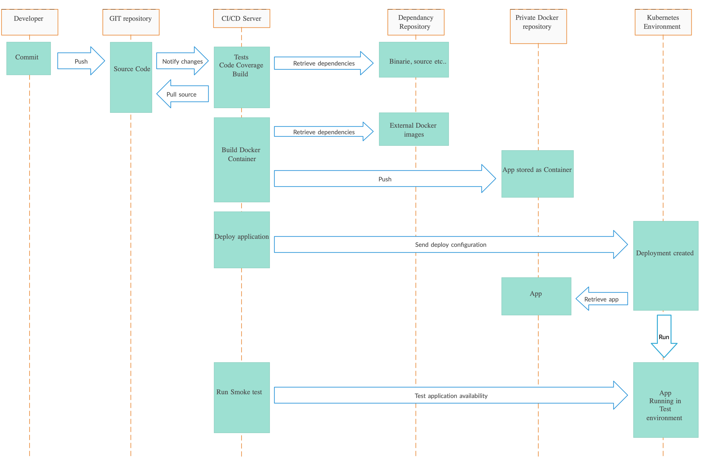

# CI/CD

CI/CD all me mõtleme reeglina “Continuous Integration” ning vastava asutuse strateegiast ja võimalustest lähtuvalt kas “Continuous Delivery” või “Continuous Deployment” protsessidest tarkvara arenduses.

"Continuous Integration" praktika näeb ette, et koodihoidlasse saadetud koodi muutuste peale kompileeritakse ja testitakse, et olla pidevalt kursis koodi kvaliteediga. Eriti oluliseks muutub CI rakendamine siis, kui vähemalt kaks arendajat sama projekti kallal töötavad ning eeldab et tulemusi vähemalt korra päevas kesksesse repositooriumi saadetakse. CI kontrollib kas erinevate arendajate töö tulemid omavahel kokku sobituvad, rakendades erinevaid kontrolle nagu automaattestide käivitamine, koodi staatiline analüüs või koodi testitega kaetuse mõõtmine. Samuti saab CI abil kiiresti selgeks, kas kood ei ole sõltuvuses arendaja enda arvutis olevast keskkonnast.

CI eelduseks on keskne koodihoidla, olgu selleks siis github.com, bitbucket.org vms lahendus avalikus pilves või mõni oma installatsioon (Gitlab, Atlassian tooteperekond) privaatses andmekeskuses. Koodi halduseks on soovitav kasutada mõnda enamlevinud töövoogu nagu näiteks “Feature Branch Workflow”: https://www.atlassian.com/git/tutorials/comparing-workflows/feature-branch-workflow, kus CI rakendatakse reeglina “Master” haru peale. 

 "Continuous Delivery" on järgmine samm CI-st, mille eesmärk on väljastada valmis pakendatud tarkvara ning pakkuda sinna vähese vaevaga võimalust see otse mõnda keskkonda paigaldada. Reeglina "Continuous Delivery" puhul erinevad toodangueelsed keskkonnad saavad tarkvara ka automaatselt peale ning manuaalne ehk nupu vajutusega paigaldus jääb toodangu jaoks. CD-d tasub rakendada, kui soovitakse kiiresti näiteks arenduse käigus tagasisidet testkeskkonda paigaldatud versioonide kohta või teha teiste osapooltele kiiresti kättesaadavaks rakendusest uued versioonid. Samuti minimeerib CD võimalike inimlike eksimuste osa, sest väga vähe on käsitööd tarkvara uuendamisel. Isegi kui CD puhul teostada ka testkeskkonda manuaalne paigaldamine, hoiab see väga palju aega kokku pakettide ettevalmistamisel ja kättesaadavaks tegemisel.

"Continuous Deployment" puhul tehakse sisuliselt samad sammud nagu "Continuous Delivery" puhul, aga on automatiseeritud kogu protsess lõpuni välja, kus ka toodangusse liigub tarkvara automaatselt, nii et käsitsi sekkumist ei ole. Asutustes, kus soovitakse muudatusi toodangusse mitu korda päevas, on see ainuke võimalus piisavalt kiiresti teostada. Samas toodangusse paigaldamine paljudes kohtades toimub harvemini ning läbi muudatustehaldus protsessi, siis ei ole võimalik seda rakendada. Samuti on selle eelduseks väga kõrge automaatne kvaliteedikontroll automaattestide näol, sest arendaja käest kiiresti toodangusse liikuvat koodi keegi enam manuaalselt ei verifitseeri ja see võib tuua erinevaid probleeme endaga kaasa, kui ei ole piisavalt testitud.

Kokkuvõttes esimese kahe protsessi puhul on mõeldav, et "DEV" ja "OPS" on lahus meeskonnad ning toimub nö paketi üleandmine paigaldamiseks, kuid reeglina soovitakse testkeskkonda juba automatiseeritud paigaldust teha, sest klient tahab kiireid tulemusi näha. Samas toodangusse paigaldus võiks olla testiga ühetaoline, et ei tekiks vigu keskkondade erinevusest, seega muudab see devops meeskonna olemasolu selle eduka rakendamise eelduseks. 

Täpsemalt võib lugeda CI/CD ja Devops kohta näiteks https://www.atlassian.com/continuous-delivery/principles/continuous-integration-vs-delivery-vs-deployment või https://about.gitlab.com/blog/2019/06/12/devops-team-structure/ 

 CI/CD-d tervikuna nimetatakse ka tehnilises vaates "pipeline"-ks, mis on siis koodi või muul deklaratiivsel kujul (näiteks yaml) defineeritud protsess, mis määratleb kuidas, milliste tehnoloogiatega ja mis kujul rakenduse lähtekood liigub erinevate keskkondade ja töövahendite vahel.
 
"Pipeline" formaat sõltub konkreetsetest töövahenditest, millega seda realiseeritakse ning nende keerukus vastavalt sellele, palju me loogikat sinna kirjutame. 

### Selleks, et edukalt töötav "pipeline" tekitada, on meil vaja oma keskkonda järgmisi komponente:

1. Lähtekoodi hoidla, soovitavalt GIT põhine
2. Lähtekoodi ehitamise, testimise, pakendamise ja paigaldamise  keskkond, mis suudab hakkama saada erinevate programmerimiskeelte ja tehnoloogiatega (näiteks Gitlab, Jenkins, Atlassian Bamboo)
3. Sõltuvuste repositoorium (üks koht kus saab kätte erinevaid teeke mida näiteks Maven,Pip,Gradle,Go,npm vms tehnoloogiad vajavad)
4. Rakenduse valmispakettide hoiustamise keskkond (näiteks Docker Hub)
5. Keskkond, kuhu tarkvara paigaldada (Docker võimekusega keskkond, näiteks Kubernetes)

### Käesoleva praktikaülesande jaoks oleme valinud järgmised lahendused:

1. Gitlab (GIT)
2. Gitlab (täidab nii CI kui CD rolli)
3. mingi …..
4. Gitlab (Docker repo)
5. Riigipilve Kubernetes klaster

Praktikaülesande sisuks on luua “Hello world” rakendus Go programmeerimiskeele baasil, testida ja ehitada see binaariks ning pakendada Docker konteinerisse ja laadida see privaatsesse Docker repositooriumi.

Teine samm on paigaldada rakendus Kubernetese keskkonda, nii et see oleks konkreetse veebiaadressi pealt kättesaadav. Kubernetesesse paigaldame rakenduse standartsete vahenditega. 

### Eeldused: 

1. Git käsurea utiliit või graafiline vahend nagu Atlassian Sourcetree
2. Sobilik koodieditor pipelinede ja koodi muutmiseks, sobib hästi VS Studio Code
3. Gitlabi konto, mis on emaili teel juba edastatud
4. kubectl käsurea utiliit Kubernetese ligipääsu testimiseks + konto Riigipilves

### "Pipeline" ülesehitus antud praktilise harjutuse vaates on selline:

 [Detailse juhendi leiad siit](task.md)
