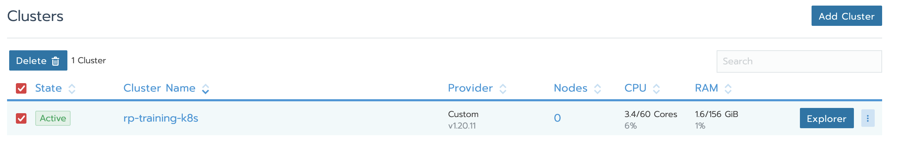
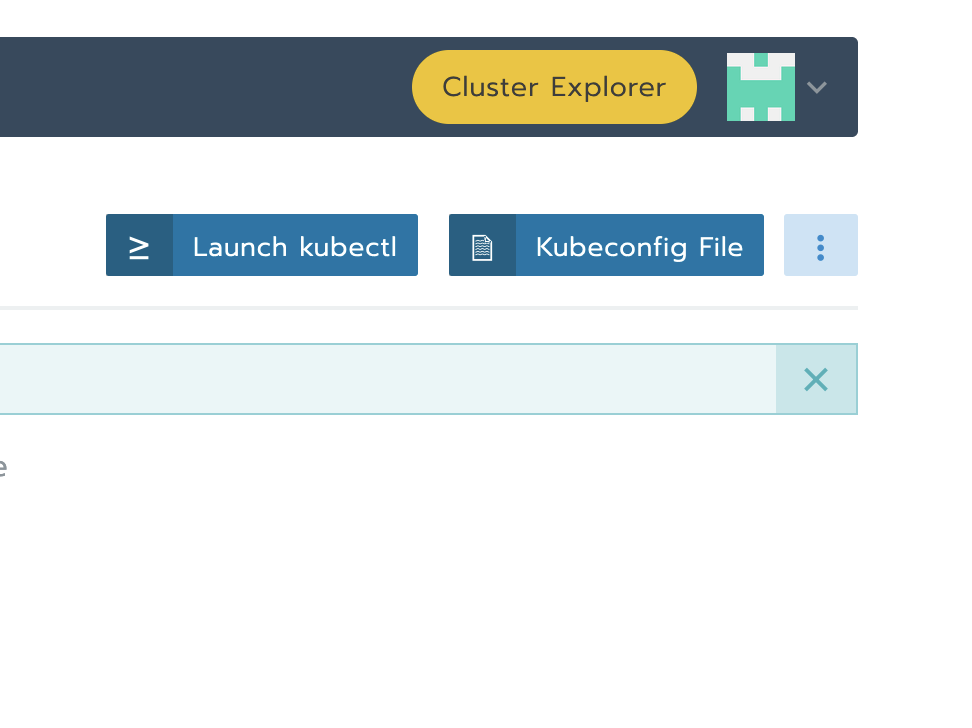
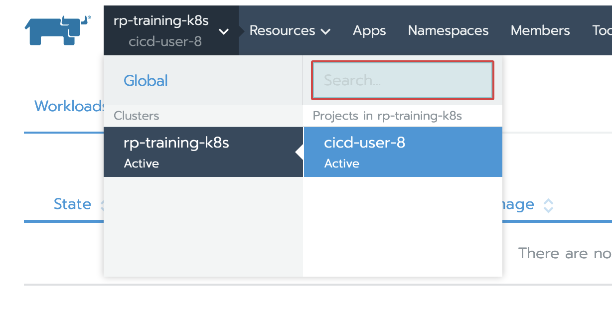

# Praktiline harjutus

## Sissejuhatus

*Mart Järvi (2020)*

---

CI/CD all me mõtleme reeglina “Continuous Integration” ning vastava asutuse strateegiast ja võimalustest lähtuvalt kas “Continuous Delivery” või “Continuous Deployment” protsessidest tarkvara arenduses.

"Continuous Integration" praktika näeb ette, et koodihoidlasse saadetud koodi muutuste peale kompileeritakse ja testitakse, et olla pidevalt kursis koodi kvaliteediga. Eriti oluliseks muutub CI rakendamine siis, kui vähemalt kaks arendajat sama projekti kallal töötavad ning eeldab et tulemusi vähemalt korra päevas kesksesse repositooriumi saadetakse. CI kontrollib kas erinevate arendajate töö tulemid omavahel kokku sobituvad, rakendades erinevaid kontrolle nagu automaattestide käivitamine, koodi staatiline analüüs või koodi testitega kaetuse mõõtmine. Samuti saab CI abil kiiresti selgeks, kas kood ei ole sõltuvuses arendaja enda arvutis olevast keskkonnast.

CI eelduseks on keskne koodihoidla, olgu selleks siis github.com, bitbucket.org vms lahendus avalikus pilves või mõni oma installatsioon (Gitlab, Atlassian tooteperekond) privaatses andmekeskuses. Koodi halduseks on soovitav kasutada mõnda enamlevinud töövoogu nagu näiteks “Feature Branch Workflow”: https://www.atlassian.com/git/tutorials/comparing-workflows/feature-branch-workflow, kus CI rakendatakse reeglina “Master” haru peale. 

"Continuous Delivery" on järgmine samm CI-st, mille eesmärk on väljastada valmis pakendatud tarkvara ning pakkuda sinna vähese vaevaga võimalust see otse mõnda keskkonda paigaldada. Reeglina "Continuous Delivery" puhul erinevad toodangueelsed keskkonnad saavad tarkvara ka automaatselt peale ning manuaalne ehk nupu vajutusega paigaldus jääb toodangu jaoks. CD-d tasub rakendada, kui soovitakse kiiresti näiteks arenduse käigus tagasisidet testkeskkonda paigaldatud versioonide kohta või teha teiste osapooltele kiiresti kättesaadavaks rakendusest uued versioonid. Samuti minimeerib CD võimalike inimlike eksimuste osa, sest väga vähe on käsitööd tarkvara uuendamisel. Isegi kui CD puhul teostada ka testkeskkonda manuaalne paigaldamine, hoiab see väga palju aega kokku pakettide ettevalmistamisel ja kättesaadavaks tegemisel. Mikroteenuste arenduses muutub CD sisuliselt hädavajalikuks, sest käsitsi suuremad hulka teenuseid ei halda efektiivselt ära.

"Continuous Deployment" puhul tehakse sisuliselt samad sammud nagu "Continuous Delivery" puhul, aga on automatiseeritud kogu protsess lõpuni välja, kus ka toodangusse liigub tarkvara automaatselt, nii et käsitsi sekkumist ei ole. Asutustes, kus soovitakse muudatusi toodangusse mitu korda päevas, on see ainuke võimalus piisavalt kiiresti teostada. Samas toodangusse paigaldamine paljudes kohtades toimub harvemini ning läbi muudatustehaldus protsessi, siis ei ole võimalik seda rakendada. Samuti on selle eelduseks väga kõrge automaatne kvaliteedikontroll automaattestide näol, sest arendaja käest kiiresti toodangusse liikuvat koodi keegi enam manuaalselt ei verifitseeri ja see võib tuua erinevaid probleeme endaga kaasa, kui ei ole piisavalt testitud.

Kokkuvõttes esimese kahe protsessi puhul on mõeldav, et "DEV" ja "OPS" on lahus meeskonnad ning toimub nö paketi üleandmine paigaldamiseks, kuid reeglina soovitakse testkeskkonda juba automatiseeritud paigaldust teha, sest klient tahab kiireid tulemusi näha. Samas toodangusse paigaldus võiks olla testiga ühetaoline, et ei tekiks vigu keskkondade erinevusest, seega muudab see devops meeskonna olemasolu selle eduka rakendamise eelduseks. 

Täpsemalt võib lugeda CI/CD ja Devops kohta näiteks https://www.atlassian.com/continuous-delivery/principles/continuous-integration-vs-delivery-vs-deployment või https://about.gitlab.com/blog/2019/06/12/devops-team-structure/ 

CI/CD-d tervikuna nimetatakse ka tehnilises vaates "pipeline"-ks, mis on siis koodi või muul deklaratiivsel kujul (näiteks yaml) defineeritud protsess, mis määratleb kuidas, milliste tehnoloogiatega ja mis kujul rakenduse lähtekood liigub erinevate keskkondade ja töövahendite vahel.
 
"Pipeline" formaat sõltub konkreetsetest töövahenditest, millega seda realiseeritakse ning nende keerukus vastavalt sellele, palju me loogikat sinna kirjutame. 

## Eeldused

Ülesannet saab teha kas enda masinas, misjuhul on vaja järgnevaid tööriistu:

* git
* docker
* kubectl
* SSH võimelist terminali

Või kasutades meie poolt antavat masinat, misjuhul on vaja:

* SSH võimelist terminali

## Töötoa plaan

Tänases töötoas on plaanis läbi töötada ühe CI/CD pipeline ehitamine algusest peale, ning välja jõuda automaatselt käima pandud rakenduse täieliku deploymentini.

Kõigepealt võtame ette GitLabi, kus seame üles enda projekti ning eeldused nagu runneri.
Seejärel tuleb konfida Kubernetest, et see oleks nõus meie projekti serveerima.
Kõige lõpus hakkame pihta põhilise osaga - ehitame GitLab sisse enda pipeline'i, proovime läbi erinevaid lahendusi ja variante, ning lõpus näitame ka kuidas koodi paremini struktueerida.

Kel soovi ja seda alguse värki tunneb, võib vabalt lõpupoolt lahendama hakata. Kaks tundi on lühike aeg, ei tea kas selleni jõuame.

## Osa I - GitLab

### Praktilise osa teenused ja ressursid

Igale osalejale jaotatakse paberi peal kasutajanimi ja parool. Näevad välja midagi sellist:

```
cicd-user-X
LoJaspgNFoasdfnAOsdui
```

See number X on teie osaleja number. Ligipääsud teistesse kohtadesse käivad ka selle alusel.

Teenused:
* Kubernetese klastri veebiaadress: https://rp-rancher.opnd.eu (kasutajanimi: `cicd-user-X`)
* Koodirepositooriumi veebiaadress: https://gitlab.kratt.ai (kasutajanimi: `cicd-user-0X`)
* Vajaduse korral privaatse VM aadress: `ssh root@cicd-user-0X.cloud.ut.ee` 

Parool on ühel inimesel kõigis teenustes sama.

### Koodivaramu (GitLab) kasutamine

* Mine aadressile https://gitlab.kratt.ai
* Logi sisse eelnevalt saadud kontoga
* Loo omale unikaalse nimega grupp - see on ainult sinu jaoks.
    * Loomise käigus küsitakse erinevaid küsimusi, valesid vastuseid siin ei ole.
* Loo grupi sisse endale piisavalt unikaalse aga sobiva projekt.
* Klooni projekt endale personaalsesse arvutisse või meie poolt antud VM-i:

`git clone https://gitlab.kratt.ai/<grupp>/<projekt>.git`

### Projekti esimene commit

Rakendus millega me tegutseme hakkame on täiesti tavaline `nginx` veebiserver koos meie endi kirjutatud HTML veebilehega. 

Veebliehe koodi osa jaoks loo projekti alla kaust `src` kuhu saad lisada lähtekoodi ja temale vajalikud failid.

Veebileheks võib olla misiganes valiidne HTML+CSS+JS kombinatsioon, aga kui endal ideed puudu, võib võtta järgmise malli `index.html`:

```html
<!DOCTYPE html>
<html>
<body>

<h1>Tere tulemast :)  __GITLAB_USER_LOGIN__ konteineri</h1>
<p>Tere tulemast maailm!</p>

</body>
</html>
```

Kindlasti ära unusta lisamast mingit ära tuntavat teksti- või koodijuppi - see on hiljem vajalik selleks, et Kubernetese klastris olevat rakendust üheselt tuvastada.

Selle sisu kirjutame meie projekti kaustas faili nimega `index.html`. Seejärel tuleks luua `git commit` ja see commit `main` branchi üles lükata.

* `git add index.html` # Lisab uue faili giti poolt jälgimise alla
* `git commit -m "indeks lehe lisamine"` # Teeb snapshoti hetkeseisust koos kirjeldava tekstiga
* `git push -u origin main` # Saadab viimased commitid meie GitLab projekti poole teele

Paar hetke pärast `git push` käsku peaks sisu ka https://gitlab.kratt.ai lehel projekti kaustas nähtaval olema.

### Docker konteineri loomine

Selleks, et meie HTML faili saaks veebi kuvada, on meil vaja pakendada see fail kuidagi veebiserveri alla.

Selleks kasutame `nginx` image't, mis on kellegi teise (usaldusväärse!) poolt juba varem loodud. Tõmbame tema versiooni image'st alla, paneme oma faili sinna sisse, ning üritame tööle panna.

Selleks loome faili nimega `Dockerfile`, ja paneme sinna sisse järgneva koodi:

```
FROM bitnami/nginx:1.21 # Võta eelehitatud image

ADD src/index.html /app/index.html # Pane meie fail õigesse kohta
```

Nüüd tuleb see image kokku ehitada ja käima panna. Selleks teeme järgnevalt:

* `docker built . -t cicd` # Ehita praeguses kaustas oleva Dockerfile alusel kokku image nimega `cicd`
* `docker run -d -p 8080:8080 cicd` # Käivita cicd image alusel konteiner mis kuulab pordil 8080

Seejärel peaks olema meie sisestatud leht kättesaadaval URL-il `http://localhost:8080`, e.g. `curl localhost:8080`.

## Osa II - Kubernetes

Enne, kui me saame CI/CD-d ehitama hakata, peame üles seadma ligipääsu Kubernetese klastrile.

### Kubernetesele ligipääs (UI)

Kubernetesele ligi pääsemiseks tuleb võtta saadud kasutajanimi ja parool, ning minna nendega aadressile https://rp-rancher.opnd.eu.

Sisse logitud vaates peaks avanema nimekiri klastritest, kus on praegu üks klaster nimega `rp-training-k8s`.



Enne kui me saame midagi Kubernetesesse deploy'da, peame me tegema loogiliselt eraldatud nimeruumi meie endi jaoks. Selleks tuleb minna `Projects/Namespaces`, ja enda kasutajanimega projekti sisse luua uus `namespace`. Nimetada võib seda kuidasiganes unikaalselt, aga, nii et 32 kohalist algarvu ei soovita.

### Kubernetesele ligipääs (CLI)

Sisse logitud vaates peaks avanema nimekiri klastritest, kus on praegu üks klaster nimega `rp-training-k8s`. Selle klastri nimele peale vajutades avaneb uus vaade, mille paremal üleval on nupp `Kubeconfig file`.



Kui ei avane õige vaade, tuleb kuidagi tagasi jõuda klastrivaatesse, et näha neid nuppe.


> Vasakpoolne `rp-training-k8s` nupp

Vajutades `Kubeconfig file` nupule näidatakse tervet `KUBECONFIG` faili, mida saab kasutada meie Kubernetesele ligipääsuks. Selle nupu väljund tuleks panna enda kasutatavas privaatmasinas või VM'is `~/.kube/config` faili sisuks. 

Seejärel saab `kubectl` tööriistaga klastrile ligi. Nt:

```
kubectl get all -n <namespace>
```

Kus `<namespace>` on meie endi tehtud nimeruumi nimi.

Selleks, et ei peaks nimeruumi nime kogu aeg sisse trükkima, võib jooksutada järgneva käsu:

```
kubectl config set-context --current --namespace=<nimeruumi_nimi>
```

Seejärel kasutavad järgnevad käsud seda nimeruumi automaatselt.

### Kubernetese deploy failide loomine

Selleks, et saaksime hiljem luua pipeline'i, et asjad kubernetesesse gitlabiga deploy'da, peame kõigepeal looma kubernetese enda deploy failid. Selleks teeme kausta `deploy/` ja paneme sinna sisse failid, millest igaüks kirjeldab erinevat ressurssi Kubernetese sees.

Fail `deploy/namespace.yml`, mis kirjeldab ära Kubernetese nimeruumi. Seda me tegime juba UI's manuaalselt, aga see samm kindlustab ka automaatse tekkimise.:
```
apiVersion: v1
kind: Namespace
metadata:
  name: __NS__
```

Fail `deploy/deployment.yml`. Sellega me paigaldame rakenduse konteineritena Kubernetesesse. Oleme lisanud ka siia ka kontrolli,
et rakenduse käivitumist kontrollib süsteem ka spetsiaalse aadressi kaudu, samuti paigaldame kaks instantsi.
```
apiVersion: apps/v1
kind: Deployment
metadata:
  name: cicd
spec:
  replicas: 2
  selector:
    matchLabels:
      app: cicd
  template:
    metadata:
      labels:
        app: cicd
    spec:
      imagePullSecrets: 
      - name: docker-registry
      containers:
        - name: cicd
          image: __IMAGE__
          ports:
            - containerPort: 8080
          livenessProbe:
            httpGet:
              path: /
              port: 8080
            initialDelaySeconds: 2
            periodSeconds: 2
```


Selleks et rakendus oleks kättesaadav teiste komponentide poolt (näiteks keskne IngressController), on meil vaja defineerida teenus, mis päringud rakenduse poole edastab. Selleks loome faili `deploy/service.yml`. 
```
apiVersion: v1
kind: Service
metadata:
  name: cicd-service
  labels:
    run: cicd
spec:
  type: ClusterIP
  ports:
    - port: 8080
      targetPort: 8080
      protocol: TCP
      name: http
  selector:
    app: cicd
```

Keskse koormusjaoturi (Ingress Controller) konfiguratsiooni konkreetse rakenduse jaoks seadistame eraldi konfiguratsioonina. Selleks
loome faili `deploy/ingress.yml`. Antud konfiguratsioon määratleb ära, et meie rakendus on kättesaadav aadresslt
__HOST__, mille me pärastpoole CICD pipeline'is üle kirjutame $CI_PROJECT_NAME.$BASE_DOMAIN muutujatega.
```
apiVersion: networking.k8s.io/v1beta1
kind: Ingress
metadata:
  name: cicd-ingress
spec:
  rules:
    - host: __HOST__
      http:
        paths:
          - backend:
              serviceName: cicd-service
              servicePort: 8080
            path: /
```

Nagu näha, siis mitmes kohas on meil kasutusel placeholderid nagu `__HOST__`, `__NS__` jms. Seetõttu me ei saa neid otseselt testida, ja aja kokkuhoiu huvides me siin seda testi läbi ei tee. Küll aga kui on endal soovi, tuleks need muutujad välja vahetada, ja saab ise `kubectl` käsuga rakenduse klastris käima panna.

## Osa III - Automaatika

### GitLabi runneri seadistus

#### Enda masina või privaatse VM'i Docker konteineris

Kui on võimalik, siis saab gitlabi runnerit jooksutada enda masinas dockeri konteineris.

Seda kasutada instantside ja projektide puhul, mida te usaldate. Gitlabi runner soovib konteineri jooksutamiseks privilegeeritud õigusi. Soovituslikult on luua runnerid sellistesse võrkudesse, mis on nende tööks just vajalik. Kas koodi kokkuehitamiseks kasutatav runner peab saama ligi sinna kuhu on vaja tulem paigaldada? :wink:

#### Privaatse VM'i ettevalmistus

Kuna meil kasutatavas Centos 7 VM'is on Selinux sisselülitatud, siis on vaja teha reeglites muudatused. Muudatused võimaldavad meil anda serveri docker socketile ligipääsu. Meie elu teeb lihtsamaks GitHubi projekt https://github.com/dpw/selinux-dockersock.

- Logi sisse enda `cicd-user-0X.cloud.ut.ee` VM'i

- ```
  yum install policycoreutils policycoreutils-python checkpolicy
  git clone https://github.com/dpw/selinux-dockersock.git
  cd selinux-dockersock/
  make
  semodule -i dockersock.pp
  ```

- Kui peaks olema vajadus mooduli eemaldamise järgi

  ```
  semodule -r dockersock
  ```

#### Runneri paigaldus

- https://docs.gitlab.com/runner/install/docker.html

- Käivitame runneri

  - Linux:

    ```
    docker run -d --name gitlab-runner --restart always \
    -v /srv/gitlab-runner/config:/etc/gitlab-runner \
    -v /var/run/docker.sock:/var/run/docker.sock \
    gitlab/gitlab-runner:alpine
    ```

  - Mac:

    ```
    docker run -d --name gitlab-runner --restart always \
    -v /Users/Shared/gitlab-runner/config:/etc/gitlab-runner \
    -v /var/run/docker.sock:/var/run/docker.sock \
    gitlab/gitlab-runner:alpine
    ```

- Registreerime runneri enda loodud Gitlabi grupi alla ja enda valitud siltidega
  - Registreerimis aadressi ja võtme saad loodud grupi `CI/CD` seadete `Runners` menüüpunktist
  
  - Alustame registreerimis protsessiga
  
    - Linux:
  
      ```
      docker run --rm -it -v /srv/gitlab-runner/config:/etc/gitlab-runner gitlab/gitlab-runner:alpine register -n \
        --url https://gitlab.kratt.ai/ \
        --registration-token $REGISTREERIMIS_VÕTI \
        --executor docker \
        --description "Luba loovusel juhtuda" \
        --docker-image "docker:19.03.12" \
        --docker-privileged \
        --docker-volumes "/certs/client"
      ```
  
    - Mac:
  
      ```
      docker run --rm -it -v /Users/Shared/gitlab-runner/config:/etc/gitlab-runner gitlab/gitlab-runner:alpine register -n \
        --url https://gitlab.kratt.ai/ \
        --registration-token $REGISTREERIMIS_VÕTI \
        --executor docker \
        --description "Luba loovusel juhtuda" \
        --docker-image "docker:19.03.12" \
        --docker-privileged \
        --docker-volumes "/certs/client"
      ```

  - NB! Registreerimise võtme saab GitLabis grupi vaates Settings -> CI/CD -> Runners alt.
  - Taaskäivita runner `docker restart gitlab-runner` 
  
- Runner on paigaldatud ja loodud grupi `CI/CD` seadete `Runners` menüüpunktis nähtav.

- NB: Palun kohe kindlasti eemalda enda masinast runner peale tänast töötuba. 

  - ```
    docker stop gitlab-runner && docker rm gitlab-runner
    rm -rf /Users/Shared/gitlab-runner/
    ```

### GitLab runneri test ja esimene CICD pipeline

GitLab puhul CI/CD konfigureerimine käib põhiliselt läbi ühe faili, mille nimi on `.gitlab-ci.yml`.

Selleks, et veenduda meie runnerite töös ja saada kiiresti käsi soojaks CI/CD-ga, teeme esimese lihtsa `Hello World` pipeline'i.

Paneme oma repositooriumi `.gitlab-ci.yml` faili sisse järgneva, ning pushime koodi üles:

```
image: 
  name: alpine

before_script:
  - echo "Hello Pre-Script"

stages:
  - example

example:
  stage: example
  script:
    - echo "Hello World Example"
```

Peale pushi minnes GitLabis CI/CD -> Pipelines alla, saab vaadata kuidas tööl läheb koos temalt tuleva väljundiga. Sellest tööst muidugi väga huvitavat väljundit ei tule, aga käe saab juba soojaks.

### Image pushimine GitLab registrisse

Kuna Kuberneteses võib olla teadmata arv nodesid, siis image toimetamine Kuberneteseni push metodoloogiaga oleks äärmiselt keeruline (image peab olema iga node peal). Seetõttu töötab best-practice poolest Kubernetes nii, et pöördub ise konteinerit käima pannes konteinerite image repositooriumi (registri) poole.

GitLabil on õnneks endal olemas sisse ehitatud register. Paneme oma tehtud HTML lehe image sinna siis üles automaatselt. Selle jaoks loome projekti peakausta `Dockerfile` faili sisuga:

```
FROM bitnami/nginx:1.21

ADD src/index.html /app/index.html
```

Muudame `.gitlab-ci.yml` nii, et CI/CD oskaks uue failiga midagi peale hakata:

```
variables:
  DOCKER_TLS_CERTDIR: "/certs"
  DOCKER_IMAGE: $CI_REGISTRY_IMAGE:$CI_COMMIT_SHA

services:
  - docker:19.03.12-dind

before_script:
  - echo "Hello Pre-Script"

stages:
  - build

build-push-docker:
  image: docker:19.03.12
  stage: build
  script:
    - sed -i "s,__GITLAB_USER_LOGIN__,$GITLAB_USER_LOGIN," src/*.html 
    - docker login -u "$CI_REGISTRY_USER" -p "$CI_REGISTRY_PASSWORD" $CI_REGISTRY
    - docker build -t $CI_REGISTRY_IMAGE:$CI_BUILD_REF .
    - docker tag $CI_REGISTRY_IMAGE:$CI_BUILD_REF $CI_REGISTRY_IMAGE:latest
    - docker push $CI_REGISTRY_IMAGE
```

Tulemuseks on meil konteiner, mis on publitseeritud meie projekti registrisse. Konteineri leiad Gitlabist menüüs `Packages & Registries` --> `Container Registry` 

### Loodud konteineri CVE kontroll

GitLabi Ultimate litsents võimaldab töövoogudes CVE kontrolle koos viisaka raporteerimisega. Kahjuks meie kasutame GitLabi tasuta versiooni ja peame selle töö käsitsi ära tegema. Esialgu loome sammu, mis ei ole edukas kriitiliste turbevigade korral. Kuid kuna me ei tegele täna DevSecOps töövooga, siis lubame hiljem töövool jätkata ka kriitiliste vigade korral.

CVE skanneerimise võimaldamiseks modifitseerime `.gitlab-ci.yml` faili vastavaks:

```
variables:
  DOCKER_TLS_CERTDIR: "/certs"
  DOCKER_IMAGE: $CI_REGISTRY_IMAGE:$CI_COMMIT_SHA

services:
  - docker:19.03.12-dind

before_script:
  - echo "Hello Pre-Script"

stages:
  - build
  - test

build-push-docker:
  image: docker:19.03.12
  stage: build
  script:
    - - sed -i "s,__GITLAB_USER_LOGIN__,$GITLAB_USER_LOGIN," src/*.html 
    - docker login -u "$CI_REGISTRY_USER" -p "$CI_REGISTRY_PASSWORD" $CI_REGISTRY
    - docker build -t $CI_REGISTRY_IMAGE:$CI_BUILD_REF .
    - docker tag $CI_REGISTRY_IMAGE:$CI_BUILD_REF $CI_REGISTRY_IMAGE:latest
    - docker push $CI_REGISTRY_IMAGE

docker-cve-scan:
  image: 
    name: aquasec/trivy:0.20.2
    entrypoint: [""] 
  stage: test
  allow_failure: false
  variables:
    DOCKER_HOST: tcp://docker:2376
    DOCKER_TLS_VERIFY: 1
    DOCKER_CERT_PATH: "$DOCKER_TLS_CERTDIR/client"
    TRIVY_USERNAME: "$CI_REGISTRY_USER"
    TRIVY_PASSWORD: "$CI_REGISTRY_PASSWORD"
    TRIVY_AUTH_URL: "$CI_REGISTRY"
  script:
    - trivy --version
    # cache cleanup is needed when scanning images with the same tags, it does not remove the database
    - time trivy image --clear-cache
    # update vulnerabilities db
    - time trivy --download-db-only --no-progress --cache-dir .trivycache/
    # Builds report and puts it in the default workdir $CI_PROJECT_DIR, so `artifacts:` can take it from there
    - time trivy --exit-code 0 --cache-dir .trivycache/ --no-progress --format template --template "@/contrib/gitlab.tpl" --output "$CI_PROJECT_DIR/gl-container-scanning-report.json" "$DOCKER_IMAGE"
    # Prints full report
    - time trivy --exit-code 0 --cache-dir .trivycache/ --no-progress "$DOCKER_IMAGE"
    # Fail on critical vulnerabilities
    - time trivy --exit-code 1 --cache-dir .trivycache/ --severity CRITICAL --no-progress "$DOCKER_IMAGE"
  cache:
    paths:
      - .trivycache/
  artifacts:
    when: always
    paths: 
      - gl-container-scanning-report.json
    expire_in: 1 week
```

Peale `git push` käsku näeme Pipelinede alt kuidas meie töövool läheb. Kuna konteineris `bitnami/nginx:1.21` on kriitilise tasemega vigu, siis meie töövoog peab läbikukkuma.

Muudame nüüd sammus `docker-cve-scan` `allow_failure: false` --> `allow_failure: true`

Nüüd peab meie töövoo lõpptulemus olema edukas hoiatusega.

### Konteineri automaatne paigaldus

Et meie arendus meeskonnal oleks mõnusam tööd teha ja et nad ei peaks ootama koodi muudatuste puhul paigaldust, loome konteinerile ka automaatse paigalduse sammu. Paigalduse teostame kubernetese klastrisse, mis on meile tänaseks päevaks võimaldatud.

### Kubernetese klastri lisamine GitLabi

Lisame kubernetese ligipääsu konfiguratsiooni grupi taseme muutuja failiks. Selleks liigu GitLabi enda loodud gruppi. Tee valikud `Settings` --> `CI/CD` --> `Variables`. Vajuta sealt `Add variable`. 

Muutuja tüübiks vali `File` ja nimeks anna talle `KUBECONFIG`. `Value`sisu saad Rancherist kopeerida `Kubeconfig file` sisu. NB: Rancher pakub võimalust kogu sisu võtta `Copy to Clipboard`.

Lisame juba ka teised muutujad samamoodi, et oleks võimalik neid pärast kasutada:

* `KUBE_NAMESPACE` väärtusega mis Kubernetese namespace'i tehes nimeks sai.
* `BASE_DOMAIN` väärtusega `k8s.kratt.ai`

### Kubernetese ühenduse testimine

Valideerime, kas meie poolt tehtud muutuja on kasutatav ja kas meil kubernetese klastriga ühendus toimib. Selle jaoks lisame `.gitlab-ci.yml` faili lõppu ühe uue etapi `deploy`.

```
...
stages:
  - build
  - test
  - deploy
...
```

Etapi sisu lisame `.gitlab-ci.yml` faili lõppu:

```
...
deploy-to-k8s:
  image: alpine/k8s:1.20.7
  stage: deploy
  script:
    - mkdir ~/.kube
    - cp $KUBECONFIG ~/.kube/config
    - kubectl version

```

Kui ühendus on edukas, on meil näha viimase sammu logi lõpus sellist osa:

```
...
Client Version: version.Info{Major:"1", Minor:"20", GitVersion:"v1.20.7", GitCommit:"132a687512d7fb058d0f5890f07d4121b3f0a2e2", GitTreeState:"clean", BuildDate:"2021-05-12T12:40:09Z", GoVersion:"go1.15.12", Compiler:"gc", Platform:"linux/amd64"}
Server Version: version.Info{Major:"1", Minor:"20", GitVersion:"v1.20.11", GitCommit:"27522a29febbcc4badac257763044d0d90c11abd", GitTreeState:"clean", BuildDate:"2021-09-15T19:16:25Z", GoVersion:"go1.15.15", Compiler:"gc", Platform:"linux/amd64"}
...
```

### Deploy pipeline lisamine

Hakkame siis lõpuks midagi ka Kubernetesesse deploy'ma.

Enne kui me saame seda teha, peame looma Kubernetese jaoks saladuse, mis lubab Kubernetesel GitLab-ist meie konteineri alla tõmmata. Selleks tuleb minna GitLab'is projekti vaates Settings -> Repository -> Deploy tokens, ja luua üks `read_registry` õigusega token, mille nimi on `gitlab-deploy-token`.

Seejärel lubab kasutada GitLab maagilisi muutujaid CI/CD pipeline sees, mis loovad automaatselt kubernetese sees saladuse. Seda näeme järgmises failis.

Asendame ka `.gitlab-ci.yml` failis kogu enne kirjutatud deploy test sammu:
```
deploy-to-k8s:
  stage: deploy
  image: registry.gitlab.com/gitlab-examples/kubernetes-deploy
  script:
    - sed -i "s~__NS__~$KUBE_NAMESPACE~g" deploy/namespace.yml
    - sed -i "s~__IMAGE__~$CI_REGISTRY_IMAGE:$CI_BUILD_REF~g" deploy/deployment.yml
    - sed -i "s~__HOST__~$CI_PROJECT_NAME.$BASE_DOMAIN~" deploy/ingress.yml
    - kubectl apply -f deploy/namespace.yml
    - kubectl config set-context --current --namespace="$KUBE_NAMESPACE"
    - echo $CI_REGISTRY, $CI_DEPLOY_USER, $CI_DEPLOY_PASSWORD
    - kubectl create secret docker-registry docker-registry --docker-server="${CI_REGISTRY}" --docker-username="${CI_DEPLOY_USER}" --docker-password="${CI_DEPLOY_PASSWORD}" --docker-email="${ADMIN_EMAIL}" -o yaml --dry-run | kubectl replace --force -f -
    - kubectl apply -f deploy/deployment.yml
    - kubectl apply -f deploy/service.yml
    - kubectl apply -f deploy/ingress.yml
```

Peale selle pipeline läbi jooksmist peaks olema meie HTML leht kättesaadav brauseriga aadressilt http://<gitlab_projekti_nimi>.k8s.kratt.ai. Kui nii ei ole, siis andke kohe julgelt teada - leiame lahenduse.

Mis maagia siin siis toimub? Siin tehakse kolm erinevat suurt sammu. 

Kõigepealt, peale kogu repo alla laadimist, käiakse meie deployment konfist üle ja asendatakse kohahoidjad vastavate muutujatega. `__NS__` asendatakse päris nimeruumi nimega, `__IMAGE__` asemel võetakse kasutusele image nimi mida me just kasutasime, ning konstrueeritakse `__HOST__` asemele domeeninimi, mille pealt pärast kogu rakendust kätte saada.

Peale seda hakatakse klastrisse sisestama meie kubectl deployment faile, aga seal vahel tehakse ka saladuse klastrisse paigaldamine veidi teise käsuga, selleks et Kubernetes saaks deploy image kätte.

### Töövoogude toomine eraldi projekti

Üksiku projekti niimoodi ära defineerimisega saab veel hakkama, aga kui projekte tuleb tihti, palju või veel õudsem, midagi tuleb pipeline sees muuta kõikide projektide jaoks, oleks vaja kuidagi struktueerida kogu pipeline koodi nii, et see oleks ka hallatav.

Õnneks on GitLabi arendajad sellele mõelnud. Tänapäeval toetatakse pipeline koodi eraldamist erinevatesse repodesse, ja siis selle include'imist - analoogselt nagu töötavad funktsioonid tavalistest progemise keeltes.

Teeme siis läbi, kuidas seda teha. Loome enda GitLab gruppi uue projekti, nimega `dev-ops`, ning tõmbame selle ka enda arvutisse.

Sinna `dev-ops` projekti kirjeldame nüüd ära kolm taset tegevusi, üritades replitseerida seda, mis meil juba üksikus projektis olemas:

- build (ehitame konteineri, pushime üles)
- test (jooksutame CVE testi)
- deploy (lükkame kubernetesesse üles)

Selleks loome siis uude projekti kolm uut faili:

.gitlab-ci-build.yml
```
build:
  image: docker:19.03.12
  stage: build
  script:
    -  sed -i "s,__GITLAB_USER_LOGIN__,$GITLAB_USER_LOGIN," src/*.html 
    - docker login -u "$CI_REGISTRY_USER" -p "$CI_REGISTRY_PASSWORD" $CI_REGISTRY
    - docker build -t $CI_REGISTRY_IMAGE:$CI_BUILD_REF .
    - docker tag $CI_REGISTRY_IMAGE:$CI_BUILD_REF $CI_REGISTRY_IMAGE:latest
    - docker push $CI_REGISTRY_IMAGE
```

.gitlab-ci-test.yml
```
cve-scan:
  image: 
    name: aquasec/trivy:0.20.2
    entrypoint: [""] 
  stage: test
  allow_failure: true
  variables:
    DOCKER_HOST: tcp://docker:2376
    DOCKER_TLS_VERIFY: 1
    DOCKER_CERT_PATH: "$DOCKER_TLS_CERTDIR/client"
    TRIVY_USERNAME: "$CI_REGISTRY_USER"
    TRIVY_PASSWORD: "$CI_REGISTRY_PASSWORD"
    TRIVY_AUTH_URL: "$CI_REGISTRY"
  script:
    - trivy --version
    # cache cleanup is needed when scanning images with the same tags, it does not remove the database
    - time trivy image --clear-cache
    # update vulnerabilities db
    - time trivy --download-db-only --no-progress --cache-dir .trivycache/
    # Builds report and puts it in the default workdir $CI_PROJECT_DIR, so `artifacts:` can take it from there
    - time trivy --exit-code 0 --cache-dir .trivycache/ --no-progress --format template --template "@/contrib/gitlab.tpl" --output "$CI_PROJECT_DIR/gl-container-scanning-report.json" "$DOCKER_IMAGE"
    # Prints full report
    - time trivy --exit-code 0 --cache-dir .trivycache/ --no-progress "$DOCKER_IMAGE"
    # Fail on critical vulnerabilities
    - time trivy --exit-code 1 --cache-dir .trivycache/ --severity CRITICAL --no-progress "$DOCKER_IMAGE"
  cache:
    paths:
      - .trivycache/
  artifacts:
    when: always
    paths: 
      - gl-container-scanning-report.json
    expire_in: 1 week
```

.gitlab-ci-deploy.yml
```
deploy:
  stage: deploy
  image: registry.gitlab.com/gitlab-examples/kubernetes-deploy
  script:
    - sed -i "s~__NS__~$KUBE_NAMESPACE~g" deploy/namespace.yml
    - sed -i "s~__IMAGE__~$CI_REGISTRY_IMAGE:$CI_BUILD_REF~g" deploy/deployment.yml
    - sed -i "s~__HOST__~$CI_PROJECT_NAME.$BASE_DOMAIN~" deploy/ingress.yml
    - kubectl apply -f deploy/namespace.yml
    - kubectl config set-context --current --namespace="$KUBE_NAMESPACE"
    - echo $CI_REGISTRY, $CI_DEPLOY_USER, $CI_DEPLOY_PASSWORD
    - kubectl create secret docker-registry docker-registry --docker-server="${CI_REGISTRY}" --docker-username="${CI_DEPLOY_USER}" --docker-password="${CI_DEPLOY_PASSWORD}" --docker-email="${ADMIN_EMAIL}" -o yaml --dry-run | kubectl replace --force -f -
    - kubectl apply -f deploy/deployment.yml
    - kubectl apply -f deploy/service.yml
    - kubectl apply -f deploy/ingress.yml
```

Kui need on tehtud, siis tuleks luua commit ja lükata need failid GitLab'i, eelnevalt loodud `dev-ops` projekti üles.

Seejärel jätkame tegevust meie algses projektis, kus varem oli kogu deployment tehtud. Võtame nüüd oma `.gitlab-ci.yml` failis kõik CI/CD pipeline'id kõrval olevast `dev-ops` projektist. Selleks teeme nii, et muudame oma `.gitlab-ci.yml` faili, ja eemaldame sealt varasema sisu:

```
variables:
  DOCKER_TLS_CERTDIR: "/certs"
  DOCKER_IMAGE: $CI_REGISTRY_IMAGE:$CI_COMMIT_SHA

services:
  - docker:19.03.12-dind

stages:
  - build
  - test
  - deploy

include:
  - project: "<minu_grupp>/dev-ops"
    file: "/.gitlab-ci-deploy.yml"
  - project: "<minu_grupp>/dev-ops"
    file: "/.gitlab-ci-test.yml"
  - project: "<minu_grupp>/dev-ops"
    file: "/.gitlab-ci-build.yml"
```

Selle uue `.gitlab-ci.yml` üles lükates käivitub uuesti pipeline, seekord kasutades pipeline definitsioone teisest repositooriumist. See tähendab nüüd seda, et väga sarnase `.gitlab-ci.yml` faili ja uute muutujatega oleks väga lihtne lisada uusi projekte, või näiteks testkeskkondi.
